# 流体氧逸度、pH计算案例分享

#### 郭荣强
#### 2023.12.29

---
## 目录
1. 简介
2. 准备工作
3. 矿物相图绘制
4. 硫同位素等值线绘制
5. 图件及数据解读

---
## 简介
**意义**：获取流体氧逸度和pH能为我们研究流体特征、流体演化过程乃至地质事件提供重要信息。

**所需信息**：
1. 矿物组合（镜下观察）
2. 流体温压条件（流体包裹体实验）
3. 硫同位素组成（同位素分析测试）

---
## 准备工作
1. **GWB软件**：
GWB官网：https://www.gwb.com/
2. **python运行环境**：
python官网：https://www.python.org/
anaconda官网：https://www.anaconda.com/

---
## 矿物相图绘制
使用GWB可绘制矿物相图，但软件自带数据库支持的温压范围较小，无法满足需求。
因此需要额外的数据库：
https://bitbucket.org/Tutolo-RTG/pygcc/src/master/docs/output/
https://www.sciencedirect.com/science/article/pii/S0098300405000105#bib17

---
## 矿物相图绘制
**相图绘制**：打开GWB-Act2，选择File-Open-Thermo Data，打开热力学数据库文件即可将其导入。
1. 在"diagram species"栏选中需要反应物对应的离子，然后点击右边的按钮，选择反应对应的矿物，并设定离子活度。
2. 在"on axes"栏选择坐标轴，将其设定为$\rm{H}^+$和$\rm{O}_2$，根据需要设定坐标轴范围。
3. 在"in the presence of"栏选择化学反应中的其它组分，并设定好温度、压力。

---
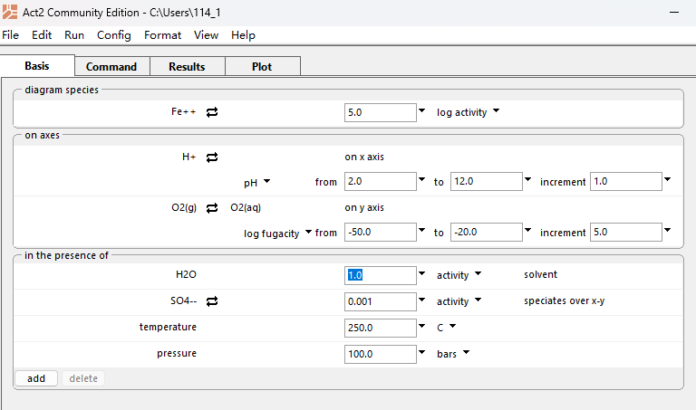

---
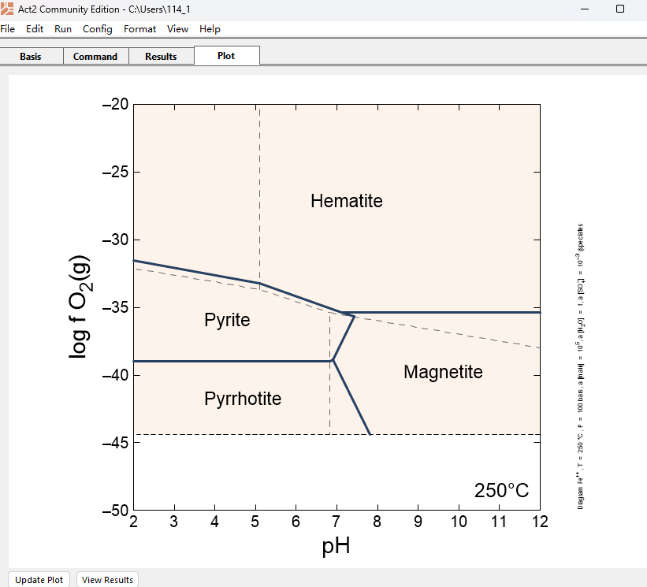

---
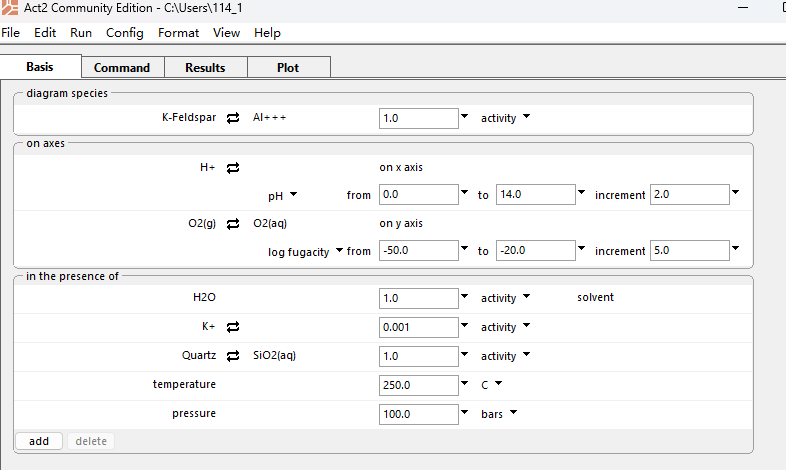

---
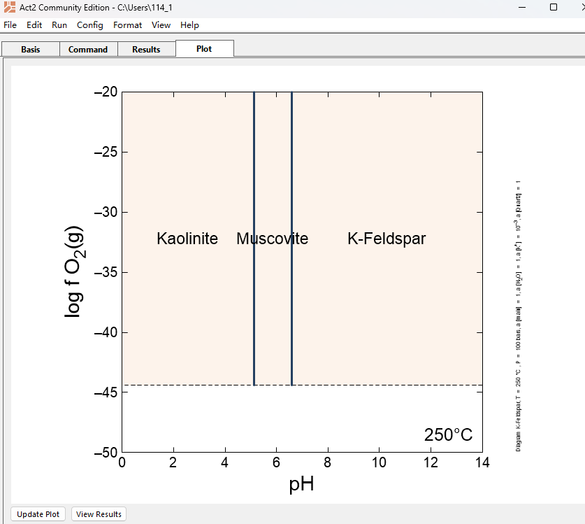

---
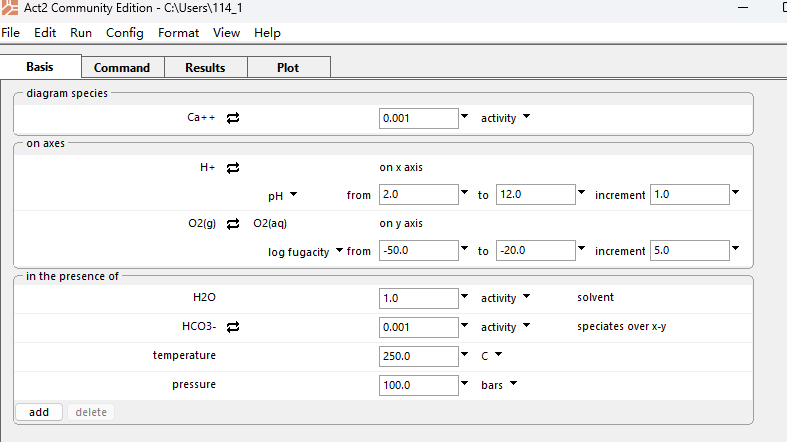

---
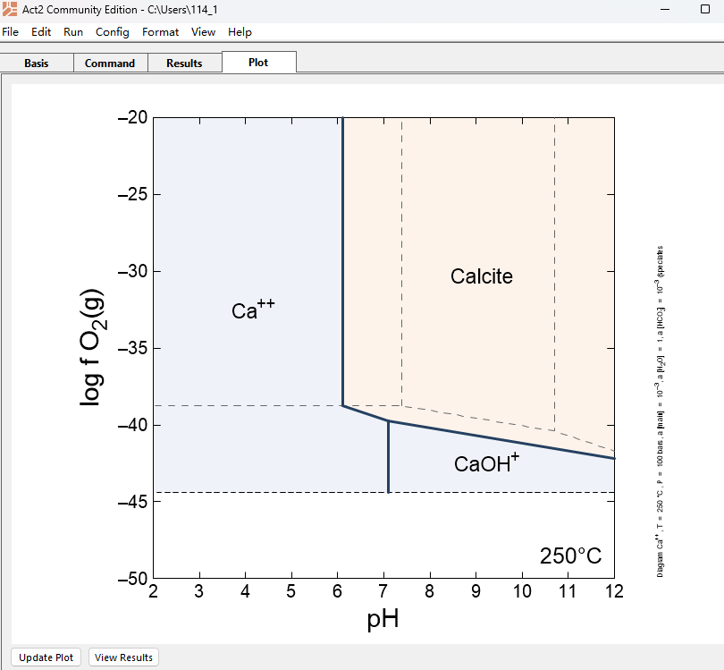

---
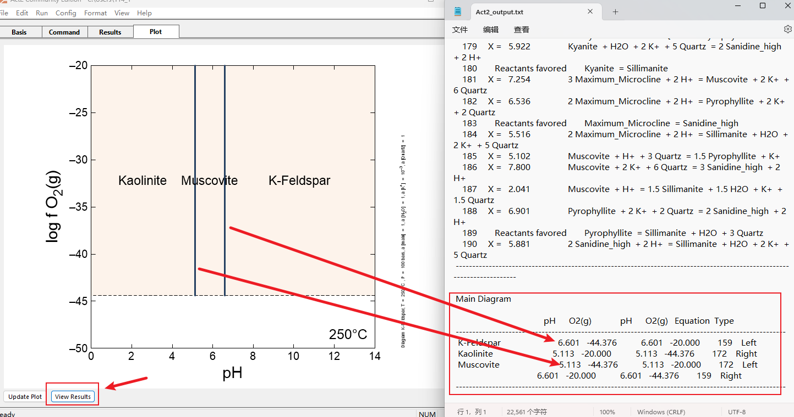

---
## 硫同位素等值线绘制
**原理**：硫的重同位素在不同离子中富集程度不同，且在温压、体系初始$\rm{δ^{34}S}$值、pH、氧逸度确定的情况下可以求得含硫化合物的$\rm{δ^{34}S}$值。将$\rm{δ^{34}S}$值相同的点连接起来，即可得到一条等值线。
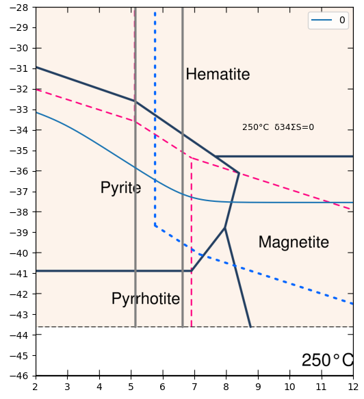

---
## 硫同位素等值线绘制
**具体操作步骤**：
1. 将GWB绘制的底图裁剪（推荐比例 横/纵=6/7，如需改变请在main函数中指定 figsize=(w, h)），放入imgs目录下，根据温度命名(如300°C对应的图文件名为"300.png")；
2. 在python脚本中导入CalcDeltaS，设定好参数，运行脚本即可；
3. output文件夹下即为生成pdf图件，可将其导入到矢量图中进一步处理。

---
**参数说明**：

1. T_c 为温度（摄氏度）；
2. delta_totalS：体系总的$\rm{δ^{34}S}$值，一般根据不同热液类型取不同的值，也可根据模拟结果反推；
3. plot_species：含硫化合物种类；

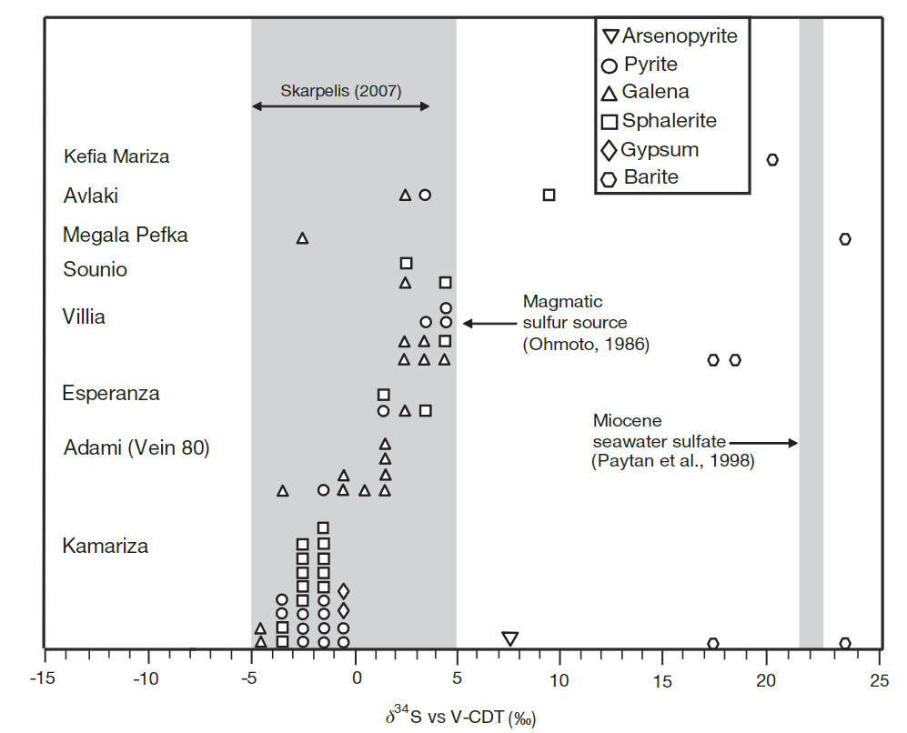

---
**参数说明**：

4. delta_list：希望绘制的等值线对应数值，可存放多个数值；
5. ranges： 包含各个温度下的pH和log_fo2范围；
6. use_default_ph_range：值为真时将会计算default_ph_range范围内的log_fo2值，否则只计算ranges对应的值。

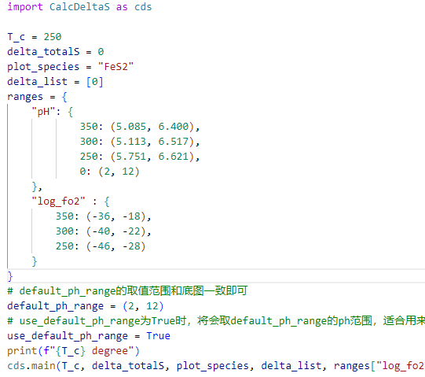

---
## 图件及数据解读
根据相图上各种矿物组合的大致范围，及$\rm{δ^{34}S}$等值线提供的约束条件，即可确定一个更小的氧逸度区间。
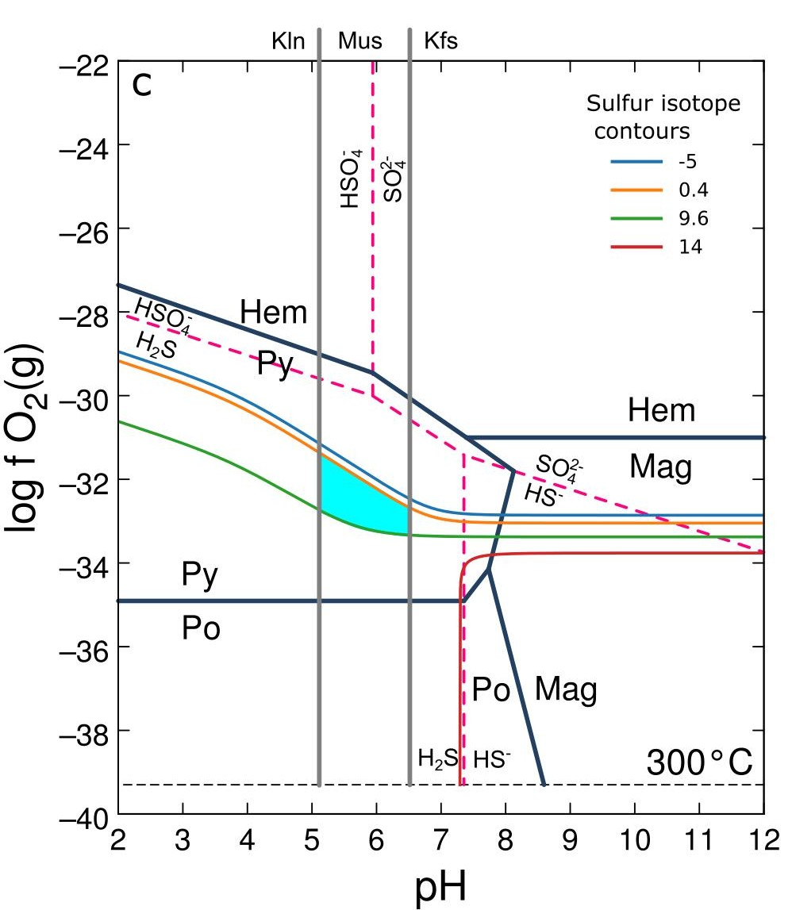

---
## Q&A

Q: 可以用免费的GWB社区版吗？
A: 对于本案例来说，社区版完全够用。

Q: 我下载（安装）了python/anaconda，但无法运行，怎么办？
A: 请检查环境变量是否配置完成，具体操作步骤可通过网络搜索获取。

Q: 因为网络问题无法安装运行代码所需的包该怎么办？
A: 请搜索关键词：pip 换源/ anaconda 换源，一般来说更换源服务器后即可正常下载、安装。

Q: 我可以分享源码吗？
A: 当然可以，也欢迎指出我的笔记、代码中的不足之处，共同进步。